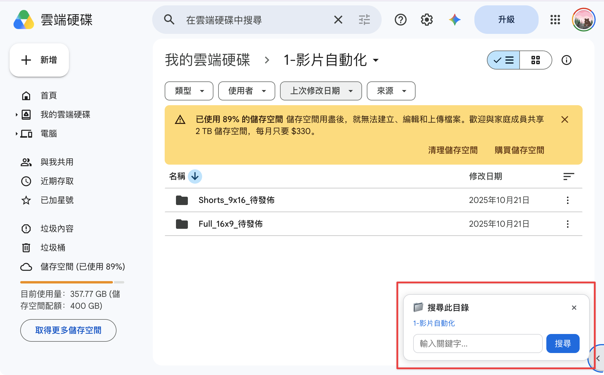

# Drive Subfolder Search Helper

## TL;DR

Google Drive 的搜尋爛透了——點進資料夾搜尋，結果卻是全域的，備份檔一起跑出來。這個 Chrome 擴充功能在右下角加一個浮動搜尋框，讓你直接搜當前資料夾。

## 痛點

- 點進某個資料夾，想搜這個目錄底下的東西，Google Drive **沒有這個功能**
- 要做到「限定目錄搜尋」，你必須：點搜尋 → 點篩選器 → 選位置 → 瀏覽到那個資料夾 → 再輸入關鍵字。五步才能做到一步的事
- 直接搜的話，備份資料夾的同名檔案全部混在一起，根本分不出哪個才是你要的

## 截圖

## 安裝

1. 下載或 clone 這個 repo
2. Chrome 開啟 `chrome://extensions/`
3. 右上角打開 **開發者模式**
4. 點 **載入未封裝擴充功能** → 選這個資料夾

## 使用

- 進入 Google Drive 任一資料夾 → 右下角出現搜尋框
- 輸入關鍵字，按 Enter 或點搜尋 → 只搜該資料夾底下的檔案
- 按 × 收起成圓形按鈕，點一下再展開
- 不在資料夾頁面時自動隱藏

## 原理

利用 Google Drive 支援的 URL 搜尋參數 `parent:FOLDER_ID`，不操作 DOM、不呼叫 API，穩定不易壞。

## 技術

- Manifest V3 Content Script
- 零權限（僅 `activeTab`）
- 不需要伺服器或 API Key
